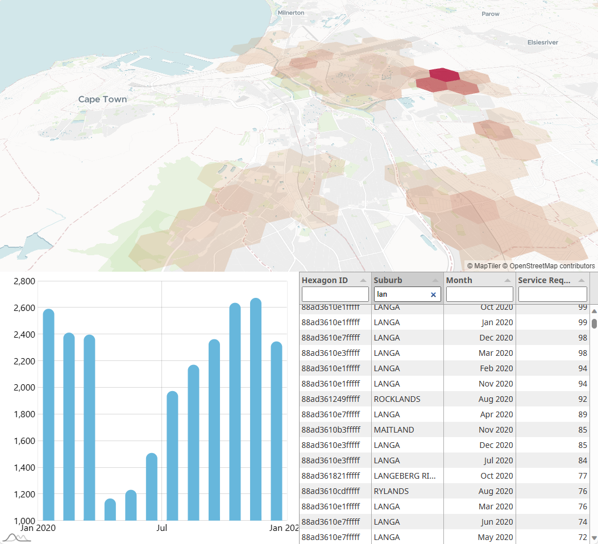
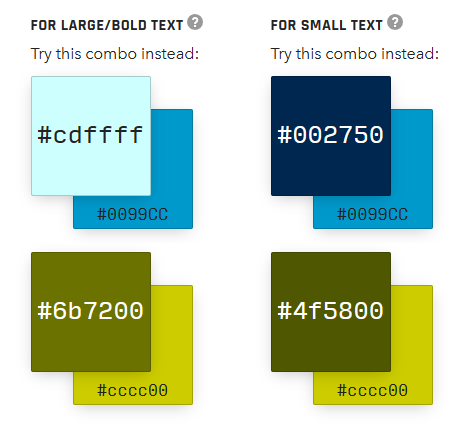
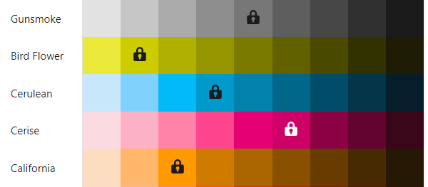
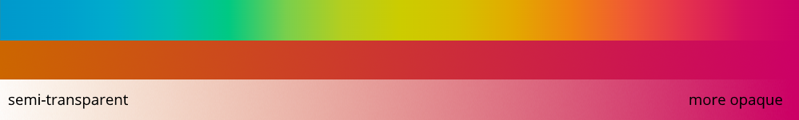

# [Developer's Log, Supplemental](https://dircodt.github.io/)

## Overview

This is the *Data Visualisation* portion of my (unfinished) solution to the City of Cape Town's Data Science Unit Code Challenge.

* [Open the interactive demo](https://dircodt.github.io/coct/index.html)

Unfortunately I was not able to complete all the features I had envisioned. I might add more features over time for my own benefit. (I don't actually use any of these libraries at my current job, but I enjoyed using Vanilla JS again.)

## Data File

The data preparation was done in this related repo:

* [https://github.com/DircoDT/ds_code_challenge](https://github.com/DircoDT/ds_code_challenge)

That repo could use a proper write-up of its own, but here I will only focus on the output required for the data visualisation task.

The download size is kept small by filtering out all the data not needed for this exercise. That includes:

* All rows other than the Water and Sanitation directorate
* All rows without a valid location (h3 hexagon ID)
* All hexagons with zero service requests

In addition, the SR count was aggregated by month for each area, instead of keeping all the individual entries. It is not strictly necessary, but having *tens* of thousands of rows gives us better interactivity than we could get with *hundreds* of thousands of rows.

The plotted dataset currently contains the following columns:

* **h3_id** - H3 hexagon ID
* **suburb** - Name of the suburb
* **month** - Month (and year)
* **sr_count** - Number of service requests

If we wanted more temporal resolution at the expense of spatial resolution, we could aggregate by week and suburb, leaving out the individual hexagons.

I considered including "Typical Time To Completion" in the plot, but the timestamp columns had a wide range, with many outliers and blank cells. As alternative we could plot new and open issues separately, to see if maintenance is able to keep up over time. That would still provide useful insights without being so dependent on both timestaps being present.

A column to indicate the severity of each service request could also be useful, but was not provided for this exercise.

## Data Storytelling

The interface has three main parts, all interactive.

* **Map** - to focus on the spatial aspect
* **Chart** - to focus on the temporal aspect
* **Table** - to act as data source for the above, including filtering

A real-world version of this interface might also have a header, footer, navigation menu, toolbars/toggles and responsive resizing for different screen sizes.

The data is loaded into the table first, where the user can filter by any of the columns. The filtered rows are then aggregated appropriately to populate both the map and the chart. With this workflow, the map and the chart are independent of each other, so one or the other can be hidden, if needed. This would be necessary for small screens, like on a phone.

A lot more functionality could still be added to provide the user with more statistical analysis capabilities. All the original data columns could also be added back in to allow for more breadth in the exploration.

It is important to differentiate between *Exploring* data and *Explaining* data. Users who want to gain new insights, usually desire as much flexibility as possible. Almost like they are using R/Python/Matlab/SQL, but without the coding requirement.

However, a data visualisation with the intent to explain previous insights, should be telling the story with as little clutter as possible. This could be done by walking the viewer through the user interface with animations and explanatory dialogue at each step, or even by avoiding any interactivity at all, apart from maybe clicking "Next"/"Continue".

## Design Principles

The current design mostly uses selected preset themes from the various libraries used. For example, the map style uses the `dataviz` style, which is an understated theme which distracts less from the visualisation on top of it. It is possible to customise individual layers and features of the map, but the preset already works well. The dark themes would require some adjustments, though.

The chart was also left with its default blue theme and white background, because it fits well with the City of Cape Town's primary website colour. It is usually best to work with a client's existing branding unless they state otherwise. For now we can look at the City of Cape Town's existing web presence to see if there are consistent themes.

Most of the website appears to be using the blue colour found in the logo, in addition to white and dark grey. Neutral colours, earth tones and blue are all good for data visualisation interfaces, because the more vibrant colours should be reserved for displaying the data itself, not the surrounding interface.

The olive colour is sometimes used for accents. None of the four main logo colours are really suitable for both black and white text, but it could be lightened or darkened to get the required contrast.

**[Contrast fixer](https://www.learnui.design/tools/accessible-color-generator.html)**:

**[Shade generator](https://atmos.style/):**

I would normally let users toggle between a Light and Dark theme. If there is no Print button on the page itself, there should also be a third CSS theme targeting Print media. This can be based on the Light theme, but with superfluous UI controls (and possibly ads) hidden, and with dark graphics restyled to use less ink/toner.

The font used in the logo seems to be a proprietary one, but the body of the website uses common `sans-serif`, which defaults to *Arial* on Windows. This is a good fallback option, but for a consistent look across different operating systems, Open Sans or Noto Sans are popular options for good all-round legibility. Noto Sans has more glyphs, in case support is needed for non-Latin alphabets.

For the hexagon colouring on the map, I initially thought of using the logo colours as a gradient, but the hexagons needed a high amount of transparency in order for the map underneath it to be visible. I ended up using only a quarter of the colours, with the reddish one at the high end to indicate many service requests (high severity).

Gradient colourmaps can be tricky to get right, considering the human eye's significant difference in sensitivity to different colours. If the rest of the interface uses neutral or blue shades, it is tempting to use green, yellow, orange and red to indicate severity, to provide the most contrast without using blue again. With wider audiences it will be necessary to take colour vision deficiencies into account, though. Especially red-green confusion is not that rare. A colourmap should ideally be monotonically increasing in perceived brightness. (Convert it to greyscale for a quick check.)

For the overall layout off the application, I made the map view the primary panel. The chart and the table need limited space, in this case. The layout is responsive, stacking all three views on top of each other when viewed in Portrait mode. If more functionality or more complex data is added in future, it may be necessary to let users toggle and resize the different panels according to their needs, or perhaps even split it off into multiple windows/screens.

## Libraries / Includes

* [deck.gl](https://github.com/visgl/deck.gl)
  For the map control
* [MapLibre GL JS](https://github.com/maplibre/maplibre-gl-js/)
  Integrated with the above
* [h3-js](https://github.com/uber/h3-js)
  To get hexagon coordinates from the H3 ID
* [pako](https://github.com/nodeca/pako)
  To decompress gzipped files in the browser
* [PapaParse](https://github.com/mholt/PapaParse)
  To parse the downloaded CSV or JSON data
* [chroma.js](https://github.com/gka/chroma.js)
  Utility functions for gradient colourmaps
* ~~[Tabulator](https://github.com/olifolkerd/tabulator)~~
  *Not as feature-rich as expected. Try AG Grid next time.*
* [AG Grid](https://github.com/ag-grid/ag-grid)
  Datatable with sorting/filtering/grouping
* [amCharts](https://github.com/amcharts/amcharts5)
  Nice interactive charts

[MapTiler](https://www.maptiler.com/) is currently used for the map tiles, but that could be switched out for a self-hosted solution, especially if we only require a small portion of the globe.

[Vite](https://github.com/vitejs/vite) can be used to add a build step, enabling more modularity, type checking, tree-shaking, unit tests, etc., when the application becomes more complex. But, for initial prototyping, it is convenient to have everything in a single HTML file.
